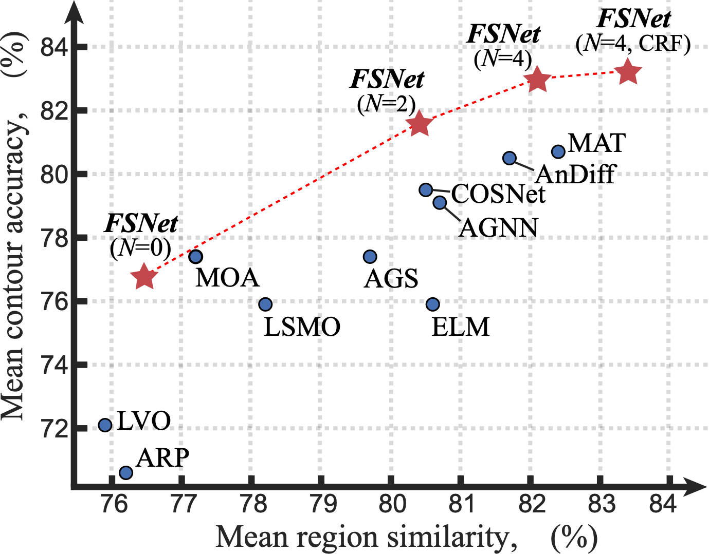
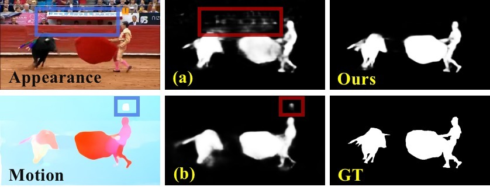
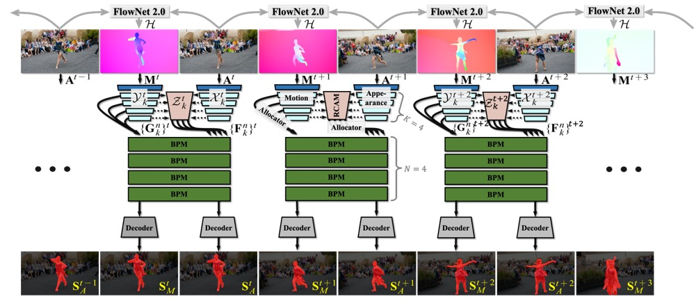
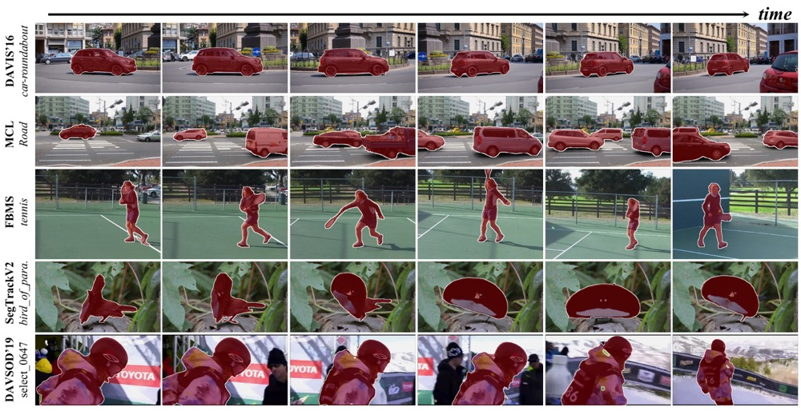

# Full-Duplex Strategy for Video Object Segmentation (ICCV, 2021)

Authors:
[Ge-Peng Ji](https://scholar.google.com/citations?user=oaxKYKUAAAAJ&hl=en), 
[Keren Fu](http://www.kerenfu.top/), 
[Zhe Wu](https://scholar.google.com/citations?hl=en&user=jT1s8GkAAAAJ), 
[Deng-Ping Fan](https://scholar.google.com/citations?hl=en&user=kakwJ5QAAAAJ)*, 
[Jianbing Shen](https://scholar.google.com/citations?hl=en&user=_Q3NTToAAAAJ), &
[Ling Shao](https://scholar.google.com/citations?user=z84rLjoAAAAJ&hl=en&oi=ao)

- This repository provides code for paper "_**Full-Duplex Strategy for Video Object Segmentation**_" accepted by the ICCV-2021 conference ([arXiv Version](https://arxiv.org/abs/2108.03151v2) / [中译版本](http://dpfan.net/wp-content/uploads/ICCV2021_VSOD_FSNet_Chinese.pdf)). 

- This project is under construction. If you have any questions about our paper or bugs in our git project, feel free to contact me.

- If you like our FSNet for your personal research, please cite this paper ([BibTeX](#4-citation)).

# 1. News

- [2021/10/16] Our journal extension is accepted by [Computational Visual Media](https://www.springer.com/journal/41095). The pre-print version could be found at this [link](https://cg.cs.tsinghua.edu.cn/cvmj/papers/CVM0262.pdf).
- [2021/08/24] Upload the training script for video object segmentation.
- [2021/08/22] Upload the pre-trained snapshot and the pre-computed results on U-VOS and V-SOD tasks. 
- [2021/08/20] Release inference code, evaluation code (VSOD).
- [2021/07/20] Create Github page.

# 2. Introduction

## Why?

Appearance and motion are two important sources of information in video object segmentation (VOS). Previous methods mainly focus on using simplex solutions, lowering the upper bound of feature collaboration among and across these two cues.

      
    <em> 
    Figure 1: Visual comparison between the simplex (i.e., (a) appearance-refined motion and (b) motion-refined appear- ance) and our full-duplex strategy. In contrast, our FS- Net offers a collaborative way to leverage the appearance and motion cues under the mutual restraint of full-duplex strategy, thus providing more accurate structure details and alleviating the short-term feature drifting issue.
    </em>

## What?

In this paper, we study a novel framework, termed the FSNet (Full-duplex Strategy Network), which designs a relational cross-attention module (RCAM) to achieve bidirectional message propagation across embedding subspaces. Furthermore, the bidirectional purification module (BPM) is introduced to update the inconsistent features between the spatial-temporal embeddings, effectively improving the model's robustness. 

      
    <em> 
    Figure 2: The pipeline of our FSNet. The Relational Cross-Attention Module (RCAM) abstracts more discriminative representations between the motion and appearance cues using the full-duplex strategy. Then four Bidirectional Purification Modules (BPM) are stacked to further re-calibrate inconsistencies between the motion and appearance features. Finally, we utilize the decoder to generate our prediction.
    </em>

## How?

By considering the mutual restraint within the full-duplex strategy, our FSNet performs the cross-modal feature-passing (i.e., transmission and receiving) simultaneously before the fusion and decoding stage, making it robust to various challenging scenarios (e.g., motion blur, occlusion) in VOS. Extensive experiments on five popular benchmarks (i.e., DAVIS16, FBMS, MCL, SegTrack-V2, and DAVSOD19) show that our FSNet outperforms other state-of-the-arts for both the VOS and video salient object detection tasks.

      
    <em> 
    Figure 3:  Qualitative results on five datasets, including DAVIS16, MCL, FBMS, SegTrack-V2, and DAVSOD19.
    </em>

# 3. Usage

## How to Inference?

- Download the test dataset from [Baidu Driver](https://pan.baidu.com/s/1lTYWFXvOnAkmH5EdvHgeyQ) (PSW: aaw8) or [Google Driver](https://drive.google.com/file/d/1ZjJoCy8YVLbDlHZXHTZHx7cdaonePlqp/view?usp=sharing) and save it at `./dataset/*`.

- Install necessary libraries: `PyTorch 1.1+`, `scipy 1.2.2`, `PIL`

- Download the pre-trained weights from [Baidu Driver](https://pan.baidu.com/s/1GRUg-n1EEV_nku-2nG3QRw) (psw: 36lm) or [Google Driver](https://drive.google.com/file/d/1-aBSca-i0-GyMryyEQ5XqrtxIwnTTAvZ/view?usp=sharing). 
  Saving the pre-trained weights at `./snapshot/FSNet/2021-ICCV-FSNet-20epoch-new.pth`

- Just run `python inference.py` to generate the segmentation results. 

- About the post-processing technique DenseCRF we used in the original paper, you can find it here: [DSS-CRF](https://github.com/Andrew-Qibin/dss_crf).

## How to train our model from scratch?

Download the train dataset from [Baidu Driver](https://pan.baidu.com/s/12l1VVZqQsQJL5clty10DbQ) (PSW: u01t) or [Google Driver Set1](https://drive.google.com/file/d/1EudIbFCOA7h8JXraFJkVAp6Q3RJsr6O_/view?usp=sharing)/[Google Driver Set2](https://drive.google.com/file/d/1Xppp0RrUuIUFAx1JlGb-Y7BXdWQFSMyi/view?usp=sharing) and save it at `./dataset/*`. Our training pipeline consists of three steps:

- First, train the model using the combination of static SOD dataset (i.e., DUTS) with 12,926 samples and U-VOS datasets (i.e., DAVIS16 & FBMS) with 2,373 samples.
    - Set `--train_type='pretrain_rgb'` and run `python train.py` in terminal

- Second, train the model using the optical-flow map of U-VOS datasets (i.e., DAVIS16 & FBMS).
    - Set `--train_type='pretrain_flow'` and run `python train.py` in terminal
    
- Third, train the model using the pair of frame and optical flow of U-VOS datasets (i.e., DAVIS16 & FBMS).
    - Set `--train_type='finetune'` and run `python train.py` in terminal
    
# 4. Benchmark

## Unsupervised/Zero-shot Video Object Segmentation (U/Z-VOS) task

> NOTE: In the U-VOS, all the prediction results are strictly binary. We only adopt the naive binarization algorithm 
> (i.e., threshold=0.5) in our experiments.

- Quantitative results (NOTE: The following results **have slight improvement** compared with the reported results in our conference paper):

    |       | mean-J | recall-J | decay-J | mean-F | recall-F | decay-F | T     |
    |-------|--------|----------|---------|--------|----------|---------|-------|
    | FSNet (w/ CRF) | 0.834  | 0.945    | 0.032   | 0.831  | 0.902    | 0.026   | 0.213 |
    | FSNet (w/o CRF) | 0.823  | 0.943    | 0.033   | 0.833  | 0.919    | 0.028   | 0.213 |

- Pre-Computed Results: Please download the prediction results of FSNet, refer to [Baidu Driver](https://pan.baidu.com/s/12fvRu-_Ca9qzYJVnmcucKA) (psw: ojsl) or [Google Driver](https://drive.google.com/file/d/1VonyqtDP9JOOWH1CPLnDmfBJQObkC6P6/view?usp=sharing).

- Evaluation Toolbox: We use the standard evaluation toolbox from [DAVIS16](https://github.com/davisvideochallenge/davis-matlab/tree/davis-2016). 
  (Note that all the pre-computed segmentations are downloaded from this [link](https://davischallenge.org/davis2016/soa_compare.html)).

## Video Salient Object Detection (V-SOD) task

> NOTE: In the V-SOD, all the prediction results are non-binary.

- Pre-Computed Results: Please download the prediction results of FSNet ([Baidu Driver](https://pan.baidu.com/s/1xWvuTIXM6YujhYFaWC9hsQ), PSW: rgk1) or [Google Driver](https://drive.google.com/file/d/1O9UzMEDqwTRMBLuX82LJ3dUPPITkvIYQ/view?usp=sharing).

- Evaluation Toolbox: We use the standard evaluation toolbox from [DAVSOD benchmark](https://github.com/DengPingFan/DAVSOD).

# 4. Citation

    @article{ji2022fsnet-CVMJ,
      title={Full-Duplex Strategy for Video Object Segmentation},
      author={Ji, Ge-Peng and Fan, Deng-Ping and Fu, Keren and Wu, Zhe and Shen, Jianbing and Shao, Ling},
      booktitle={Computational Visual Media},
      volume={8},
      year={2022},
      publisher={Springer}
    }

    @inproceedings{ji2021FSNet,
      title={Full-Duplex Strategy for Video Object Segmentation},
      author={Ji, Ge-Peng and Fu, Keren and Wu, Zhe and Fan, Deng-Ping and Shen, Jianbing and Shao, Ling},
      booktitle={IEEE ICCV},
      year={2021}
    }

# 5. Acknowledgements

Many thanks to my collaborator [Ph.D. Zhe Wu](https://scholar.google.com/citations?hl=en&user=jT1s8GkAAAAJ), 
who provides excellent work [SCRN](https://github.com/wuzhe71/SCRN) and design inspirations.
